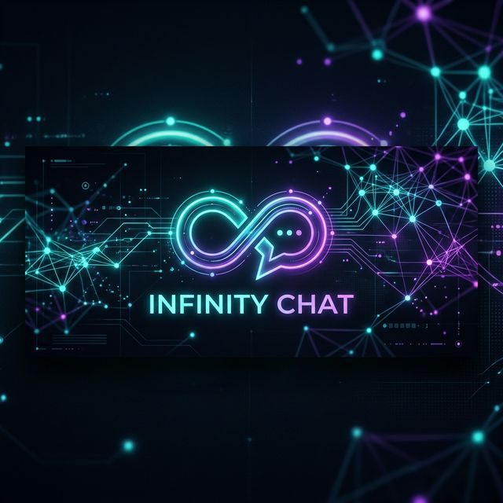
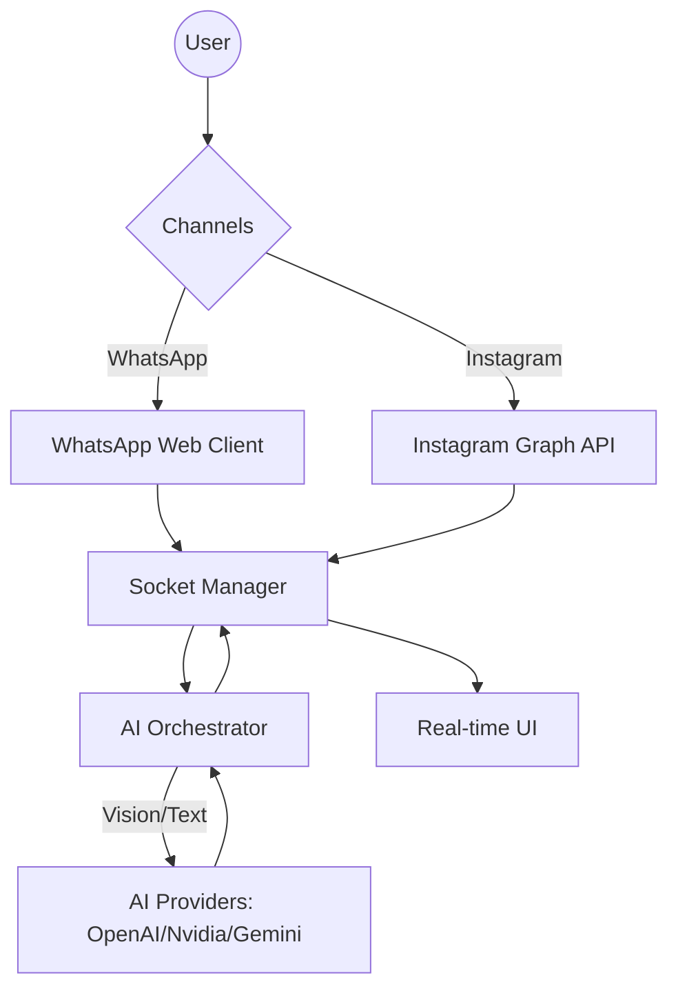

<p align="center">
  
</p>

<h1 align="center">♾️ Infinity Chat</h1>

<p align="center">
  <strong>The Ultimate Multi-Channel AI Twin Platform</strong>
</p>

<p align="center">
  
  
  
  
</p>

---

## 🌟 Overview

**Infinity Chat** transforms your digital communication. It's not just a bot; it's a high-performance, self-hosted AI digital twin that masters your unique texting style and automates your presence across major social channels with absolute precision.

### Why Infinity Chat?
- **🧠 Identity Capture**: Learns your slang, typos, and personality from chat exports.
- **👁️ Multimodal Vision**: "Eyes" for your AI—it sees and analyzes images sent by users.
- **🚀 Dual-Channel Power**: Simultaneous automation for WhatsApp and Instagram.
- **🎨 Persona Engine**: Switch between "Professional Executive," "Toxic Bestie," or "Gen-Z" modes instantly.

---

## 🛠️ Architecture



---

## 🚀 Quick Start

### 1. Installation
```bash
# Clone and install
git clone https://github.com/sanjay-m6/infinity-chat.git
cd infinity-chat
npm run install:all
```

### 2. Configuration
Create a `.env` file with your credentials:
```env
PORT=3000
OPENAI_API_KEY=sk-...
INSTAGRAM_CLIENT_ID=your_app_id
INSTAGRAM_CLIENT_SECRET=your_app_secret
```

### 3. Launch
```bash
# Build frontend and start backend
npm run build
npm start
```

---

## 📸 Instagram Integration Guide

The 1.0 release introduces official **Instagram Graph API** support:
1.  **Meta Dev Portal**: Create a "Business" app and add "Instagram Graph API".
2.  **Redirect URI**: Set to `http://localhost:3000/api/instagram/auth/callback`.
3.  **Live Mode**: Ensure your app is in Live mode or add test users in the dashboard.

---

## 🧪 AI Persona Gallery

| Persona | Vibe | Best For |
| :--- | :--- | :--- |
| **Toxic Flirty** | 😈 Sass & Charm | Playful interactions and bantering with close friends. |
| **Professional** | 👔 Cold & Precise | Business inquiries, formal networking, and authority. |
| **Gen-Z** | 💀 Brainrot & No Cap | Maximum relatability using current internet subculture. |

---

## 💻 Tech Stack

- **Frontend**: React 18, Vite, Tailwind CSS, Lucide Icons.
- **Backend**: Node.js, Express, Socket.io.
- **Automation**: Puppeteer (WhatsApp), Official Graph API (Instagram).
- **Intelligence**: OpenAI SDK (compatible with Nvidia/OpenRouter).

---

## 📝 License & Security

- **Dual Licensed**: MIT / Personal Use.
- **Privacy**: All sessions and logs are stored locally. No mid-stream data collection.

Built with 🖤 by **Infinity Team**.
