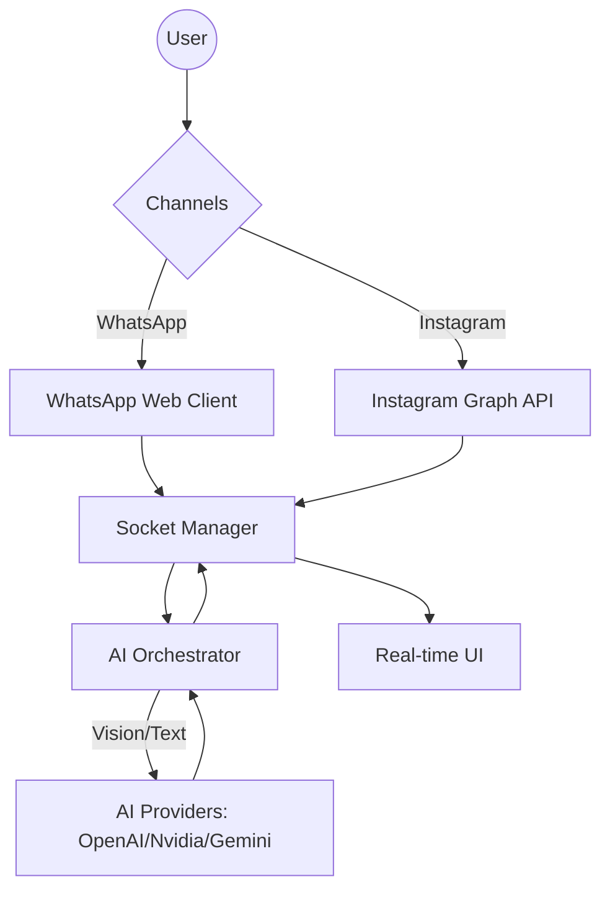

<p align="center">
  
</p>

<h1 align="center">♾️ Infinity Chat</h1>

<p align="center">
  <strong>High-Performance Multi-Channel AI Twin Platform</strong>
</p>

<p align="center">
  
  
  
  
</p>

---

## 🌟 Overview

**Infinity Chat** is the ultimate self-hosted solution for social automation. It masterfully captures your unique texting voice through advanced history analysis and automates your presence across WhatsApp and Instagram with a personalized AI digital twin.

### Core Capabilities
- **🧠 Identity Analytics**: Ingests your chat exports to mirror your slang, syntax, and emojis.
- **👁️ Multimodal Intelligence**: Context-aware vision that "sees" and discusses images.
- **🚀 Channel Synergy**: Simultaneous management of WhatsApp (Web API) and Instagram (Graph API).
- **🎭 Persona Matrix**: Hot-swap between "Professional," "Toxic," or "Gen-Z" vibes in real-time.

---

## 🛠️ System Architecture



---

## 🚀 Deployment Guide

### 1. Requirements
- **Node.js**: v18+
- **Chrome/Brave**: For WhatsApp Puppeteer engine.
- **AI Access**: API keys for OpenAI, Gemini, or Nvidia.

### 2. Rapid Install
```bash
# Clone and enter
git clone https://github.com/sanjay-m6/infinity-chat.git
cd infinity-chat

# Install all dependencies
npm run install:all

# Production Build
npm run build
npm start
```

### 3. Environment Setup (`.env`)
```env
PORT=3000
OPENAI_API_KEY=sk-...
INSTAGRAM_CLIENT_ID=your_id
INSTAGRAM_CLIENT_SECRET=your_secret
```

---

## 📸 Instagram Graph API Integration

Infinity Chat 1.0 supports the official Instagram Graph API for enterprise-grade reliability:

1.  **Meta Port**: Create a "Business" app and activate "Instagram Graph API".
2.  **Callback URL**: Set to `your-domain/api/instagram/auth/callback`.
3.  **Permissions**: Request `instagram_basic`, `instagram_manage_messages`.

---

## 🧠 Training & Memory

### How the AI Learns
1.  **Export**: Download your chat history as `.txt` files from WhatsApp.
2.  **Ingest**: Upload files via the dashboard.
3.  **Weighting**: Mark "Closest Person" files to refine style accuracy.
4.  **Adaptation**: The AI continuously refines its response logic based on persona rules.

### AI Persona Gallery
- **Toxic Flirty**: High-energy, sarcastic charm for close social circles.
- **Professional**: Authority-driven, precise corporate communication.
- **Gen-Z**: Unhinged brainrot, slang-heavy, and relatable.

---

## 💻 Technical Stack

- **UI**: React 18, Vite, Tailwind CSS v4, Lucide Icons.
- **Engine**: Node.js, Express, Socket.io (Real-time bridge).
- **API**: Official Instagram Graph API & WhatsApp Web.js.
- **Intelligence**: OpenAI SDK (Nvidia/Gemini compatibility).

---

## 📄 Licensing & Privacy

- **License**: MIT
- **Privacy Enforcement**: End-to-end local processing. Session data and chat logs never leave your server.

Built with 🖤 by **Sanjay**.
